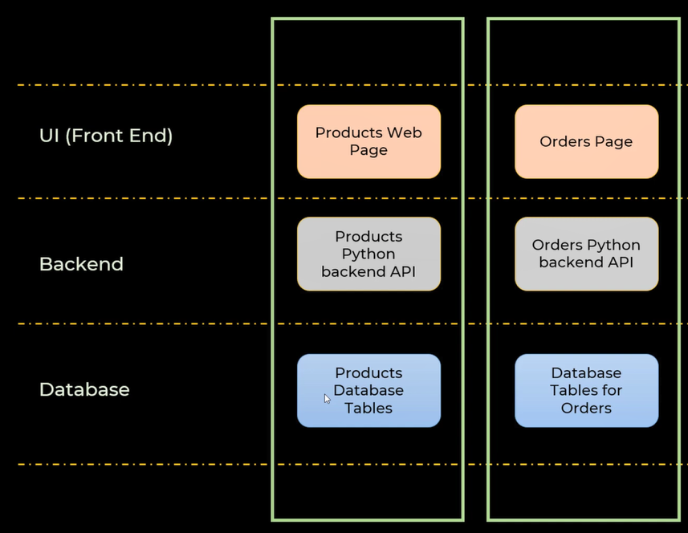

# Grocery Store Application-Python

Brief description of your project.

## Setup

1. Clone the repository:

   ```bash
   git clone https://github.com/your-username/your-repo.git

   ```

2. Navigate to the project directory:

   ```bash
   cd your-repo

   ```

3. Create a virtual environment (optional but recommended):

   ```bash
   virtualenv venv
   source venv/bin/activate  # On Windows, use `venv\Scripts\activate`


   ```

4. Install dependencies:

   ```bash
   pip install -r requirements.txt

   ```

5. Set up the database:

   ```bash
   # Run migrations
   python manage.py migrate

   # Create a superuser (optional)
   python manage.py createsuperuser
   ```

### UI Mockups

---

### Technicle Architecture

**3 Tier Software Application**

UI (HTML/CSS/JS/Bootstrap) <--> Backend (Python Flask Server) <--> MySQL

---

### Database Commands

Create Table - products

```sql
CREATE TABLE `grocery_store`.`products` (
  `product_id` INT NOT NULL AUTO_INCREMENT,
  `name` VARCHAR(80) NOT NULL,
  `uom_id` INT NOT NULL,
  `price_per_unit` DOUBLE NOT NULL,
  PRIMARY KEY (`product_id`))
```

Create Table - uom

```sql
CREATE TABLE `grocery_store`.`uom` (
  `uom_id` INT NOT NULL AUTO_INCREMENT,
  `uom_name` VARCHAR(10) NOT NULL,
  PRIMARY KEY (`uom_id`));
```

Create Table - orders

```sql
CREATE TABLE `grocery_store`.`orders` (
  `order_id` INT NOT NULL AUTO_INCREMENT,
  `customer_name` VARCHAR(80) NOT NULL,
  `total` DOUBLE NOT NULL,
  `datetime` DATETIME NOT NULL,
  PRIMARY KEY (`order_id`));
```

Create table - order details & setup foreign keys

```sql
CREATE TABLE `grocery_store`.`order_details` (
  `order_id` INT NOT NULL AUTO_INCREMENT,
  `product_id` INT NOT NULL,
  `quantity` DOUBLE NOT NULL,
  `total_price` DOUBLE NOT NULL,
  PRIMARY KEY (`order_id`),
  INDEX `fk_product_id_idx` (`product_id` ASC) VISIBLE,
  CONSTRAINT `fk_order_id`
    FOREIGN KEY (`order_id`)
    REFERENCES `grocery_store`.`orders` (`order_id`)
    ON DELETE NO ACTION
    ON UPDATE RESTRICT,
  CONSTRAINT `fk_product_id`
    FOREIGN KEY (`product_id`)
    REFERENCES `grocery_store`.`products` (`product_id`)
    ON DELETE NO ACTION
    ON UPDATE RESTRICT);
```

Insert Data - uom

```sql
INSERT INTO `grocery_store`.`uom` (`uom_id`, `uom_name`) VALUES ('1', 'each');
INSERT INTO `grocery_store`.`uom` (`uom_id`, `uom_name`) VALUES ('2', 'kg');
```

Insert Data - products

```sql
INSERT INTO `grocery_store`.`products` (`product_id`, `name`, `uom_id`, `price_per_unit`) VALUES ('2', 'rice', '2', '200');
```

Insert Data - orders

```sql
INSERT INTO `grocery_store`.`orders` (`order_id`, `customer_name`, `total`, `datetime`) VALUES ('1', 'ervin', '600', '20231229');
```

Setup Foreign Key - products table

```sql
ALTER TABLE `grocery_store`.`products`
ADD INDEX `fk_uom_id_idx` (`uom_id` ASC) VISIBLE;
;
ALTER TABLE `grocery_store`.`products`
ADD CONSTRAINT `fk_uom_id`
  FOREIGN KEY (`uom_id`)
  REFERENCES `grocery_store`.`uom` (`uom_id`)
  ON DELETE NO ACTION
  ON UPDATE RESTRICT;
```

## Used Vertical slice development



## Create the connection with SQL server

```bash
pip install mysql-connector-python
```

```python
import mysql.connector

__cnx = None


def get_sql_connection():
    global __cnx

    if __cnx == None:
        # Create the connection with sql server
        __cnx = mysql.connector.connect(
            user="root", password="password", host="127.0.0.1", database="grocery_store"
        )

    return __cnx
```

### Functions for the product handling

- get_all_products()
- insert_product(connection, product)
- delete_product(connection, product_id)
